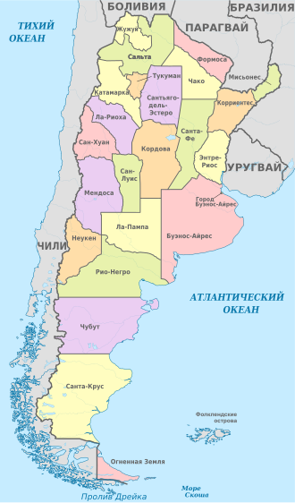
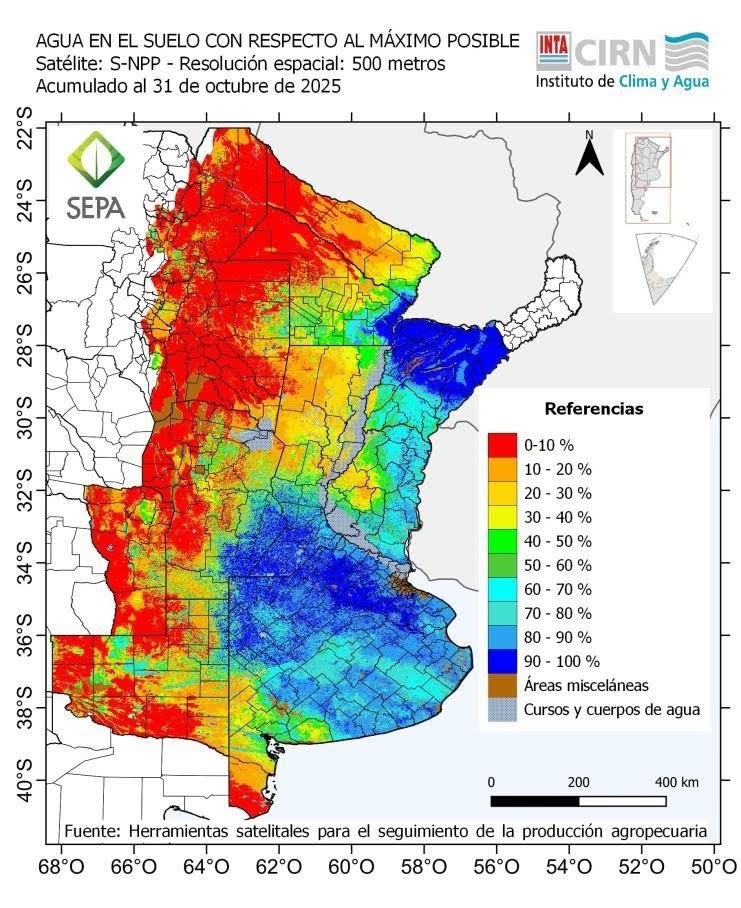
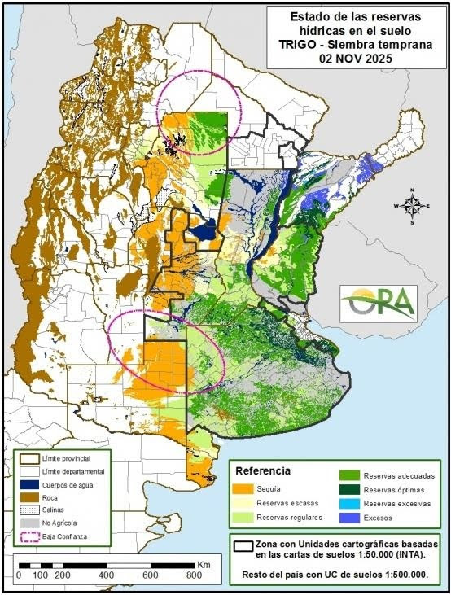
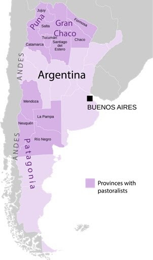

# ВВЕДЕНИЕ

Актуальность темы. Аргентина является одной из ведущих аграрных держав планеты и играет ключевую роль в обеспечении глобальной продовольственной безопасности. Сельское хозяйство и связанные с ним перерабатывающие отрасли исторически выступают краеугольным камнем аргентинской идентичности и экономической мощи. Сегодня страна является абсолютным мировым лидером по экспорту соевого шрота и масла, а также входит в число крупнейших глобальных поставщиков кукурузы, пшеницы и говядины.

В условиях сложной макроэкономической ситуации, исторически высокой инфляции и структурных реформ, которые страна проходит в 2024–2026 годах, агропромышленный комплекс (АПК) остается главным стабилизирующим фактором национальной экономики. Продукция аграрного сектора обеспечивает около 60 % всех экспортных доходов страны, являясь критически важным источником иностранной валюты. При этом современный АПК Аргентины находится на этапе масштабной трансформации: внедряются передовые биотехнологии, системы точного земледелия и искусственного интеллекта, что позволяет стране адаптироваться к климатическим изменениям и повышать свою конкурентоспособность на мировых рынках. Все это делает изучение специализации и перспектив развития агропромышленного комплекса Аргентины крайне актуальной задачей.

Объектом исследования выступает экономика Аргентины, в частности ее агропромышленный сектор.

Предметом исследования является отраслевая и экспортная специализация, природно-ресурсный потенциал, а также современные тенденции и проблемы развития агропромышленного комплекса Аргентины.

Цель индивидуального проекта заключается в комплексном анализе специализации агропромышленного комплекса Аргентины, оценке его современного состояния, роли в национальной экономике и на мировом продовольственном рынке.

Для достижения поставленной цели были сформулированы следующие задачи исследования:

1. рассмотреть экономико-географическое положение страны и оценить ее природно-ресурсный потенциал (земельные, климатические, водные ресурсы);
2. дать общую экономическую характеристику современной Аргентины и определить место сельского хозяйства в ее макроэкономике;
3. проанализировать структуру ключевых отраслей агропромышленного комплекса, включая растениеводство, животноводство и перерабатывающую промышленность;
4. выявить основные экспортно-ориентированные продукты АПК и изучить географию их поставок;
5. исследовать актуальные экономические и экологические проблемы сектора, а также перспективы его развития с учетом внедрения современных технологических инноваций (AgTech).

# 1 Экономико-географическая характеристика Аргентины

## 1.1 Общая характеристика страны

Аргентина — клиновидное государство, занимающее крайний юг Южной Америки (регион Южного конуса). География страны отличается огромным разнообразием и контрастами: от влажных тропических и субтропических лесов на севере и засушливого региона Гран-Чако до горных массивов Анд на западе и холодных степей Патагонии на юге. Главным стратегическим и сельскохозяйственным центром Аргентины является Пампа — обширная равнина в центральной части страны. Глубокие и плодородные почвы в сочетании с умеренным климатом делают этот регион одной из самых богатых сельскохозяйственных зон Южной Америки, идеально подходящей для масштабного выращивания зерновых и масличных культур, а также для пастбищного животноводства. Аргентина является одной из крупнейших стран мира: ее территория превышает 2,73 млн км² (что примерно в четыре раза больше площади штата Техас). Около 47 % от общей площади страны составляют сельскохозяйственные угодья (почти 119 млн гектаров), что формирует главную ресурсную базу государства.
Население страны по состоянию на 2023–2024 годы оценивается примерно в 45,7–46 миллионов человек. Аргентина отличается относительно низкой плотностью населения (около 16,6 человек на 1 км²), но при этом является высокоурбанизированной страной — 92 % граждан проживают в городах. Занятость в экономике распределена неравномерно: несмотря на статус аграрной державы, в самом сельском хозяйстве занято менее 1 % экономически активного населения, тогда как сфера услуг обеспечивает 76,4 % рабочих мест, а промышленность — 23 %.

{#fig:argentina}

Столицей государства является Буэнос-Айрес — крупнейший город Южного конуса, население агломерации которого превышает 15,1 млн человек. Город и прилегающие к нему территории играют ключевую роль в макроэкономике и логистике страны. Именно здесь, а также в близлежащем портовом хабе Росарио, сосредоточены главные транспортные узлы (железные дороги, портовые мощности и хранилища), обеспечивающие экспорт продукции из Пампы на мировые рынки.

Аргентина позиционируется в глобальной экономике как страна с доходами выше среднего и относится к крупнейшим агропромышленным державам мира. Агропромышленный комплекс (АПК) является фундаментом макроэкономики: продукция АПК обеспечивает более 60 % всех валютных поступлений страны и составляет около половины общей стоимости национального экспорта. Роль Аргентины на мировых продовольственных рынках критически важна:

- страна является мировым лидером по экспорту соевого шрота и соевого масла;
- входит в топ-5 ведущих мировых экспортеров кукурузы, сои и пшеницы;
- занимает прочные позиции на рынке мяса, ежегодно экспортируя свыше 900 тыс. тонн говядины (главным образом в Китай, куда уходит более 73 % поставок);
- является одним из крупнейших в мире производителей лимонов и абсолютным лидером по их промышленной переработке (экстракты, масла).

В международной торговле Аргентина выступает членом G-20, Всемирной торговой организации (ВТО) и является одним из основателей блока МЕРКОСУР. Главными торговыми партнерами страны традиционно выступают Бразилия, Китай, США и Европейский союз. В 2024–2025 годах страна проходит через фазу глубокой макроэкономической трансформации при новой администрации. Правительство внедряет программы дерегулирования, направленные на сокращение гиперинфляции и снижение высоких экспортных пошлин на сельхозпродукцию. Благодаря аграрному сектору в 2024 году Аргентине удалось добиться рекордного положительного сальдо торгового баланса в размере 18,8 млрд долларов США, что доказывает стратегическую важность АПК не только для продовольственной безопасности планеты, но и для экономической стабильности самой страны.

## 1.2 Природные ресурсы страны

Основу природно-ресурсного потенциала страны составляет колоссальный земельный фонд, который служит главным активом ее агропромышленного комплекса. Около 47 % общей площади страны (почти 119 млн гектаров) занимают сельскохозяйственные угодья. Однако распределение качественных почв крайне неравномерно: лишь около 13,2 % территории обладают высоким аграрным потенциалом для земледелия, в то время как до 70 % земель относятся к полузасушливым, гористым или слишком холодным для выращивания сельскохозяйственных культур. Главной житницей Аргентины и Южной Америки в целом является Пампа — обширная равнина с глубокими, богатыми почвами. Она традиционно делится на «Влажную Пампу» на востоке, где сосредоточено основное производство сои, кукурузы и подсолнечника, и «Сухую Пампу» на западе, которая больше подходит для выращивания пшеницы и пастбищного животноводства. Для более засушливых и маргинальных зон (около 2 млн кв. км), таких как Патагония и Гран-Чако, характерно экстенсивное животноводство.

Благодаря большой протяженности с севера на юг, климатические условия Аргентины отличаются огромным разнообразием, что позволяет выращивать широкий спектр культур. В Пампе преобладает умеренный климат с ярко выраженными сезонами: жарким летом, мягкой зимой, продолжительным вегетационным периодом и круглогодичными осадками, что идеально для масштабного производства зерновых и масличных. Северные и северо-восточные регионы (плато Парана и Месопотамия) отличаются влажным тропическим и субтропическим климатом, что способствует производству чая, йерба-мате, цитрусовых и табака. Западные и южные территории (Сухой Чако и Патагония) находятся в дождевой тени Анд, образуя засушливые степи и пустыни. Серьезной проблемой для АПК Аргентины является высокая климатическая волатильность. Сельское хозяйство регулярно страдает от чередования экстремальных засух (вызываемых феноменом Ла-Нинья) и сильных наводнений, что наносит колоссальный экономический ущерб урожаям.

Ключевыми водными артериями страны являются реки Парана и Уругвай, формирующие плодородный бассейн на востоке и обеспечивающие важнейшие логистические маршруты (Гидровия) для экспорта агропродукции. На северо-западе страны (в провинциях Тукуман, Сальта и Жужуй) летние осадки и доступ к горным рекам создают условия для выращивания влаголюбивых культур, таких как лимоны и сахарный тростник. При этом сельское хозяйство является главным потребителем пресной воды в стране: на его долю приходится около 74 % всего водозабора. Однако доля орошаемых земель крайне мала — всего 0,9 % от сельскохозяйственных угодий, что делает аргентинский АПК критически зависимым от естественных осадков и уязвимым перед глобальными климатическими изменениями. В засушливых регионах северо-запада сейчас активно внедряются системы капельного орошения.

{#fig:soil_moisture width=70%}

Помимо богатых агроклиматических ресурсов, Аргентина обладает сложной геологией и крупными запасами полезных ископаемых. Страна является четвертым по величине производителем природного газа в Латинской Америке и обладает третьими в мире запасами сланцевого газа (на гигантском месторождении Вака Муэрта). Аргентина также занимает четвертое место в мире по запасам лития — критически важного металла для глобального энергетического перехода. Кроме того, недра страны богаты нефтью, медью и золотом. Развитие энергетического сектора (особенно газодобычи) играет важную роль для агропромышленного комплекса, так как способствует снижению стоимости топлива и обеспечивает сырьем производство азотных удобрений.

## 1.3 Современное состояние экономики Аргентины

Современная экономика Аргентины представляет собой государство с уровнем доходов выше среднего, обладающее агроиндустриальной экономикой. Исторически экономика страны отличалась высокой волатильностью, чередованием периодов роста и глубоких кризисов, а также макроэкономической нестабильностью. С конца 2023 года экономика Аргентины проходит через радикальную структурную трансформацию и стабилизационную программу. Правительство взяло курс на жесткую фискальную корректировку, дерегулирование рынков, отмену ценовых контролей и снижение государственного вмешательства в экономику. В 2024 году, впервые за более чем десятилетие, Аргентине удалось достичь профицита государственного бюджета (0,3 % от ВВП), а также существенно сократить соотношение государственного долга к ВВП (с 155,4 % в 2023 году до 91,5 % в 2024 году).

Экономика Аргентины опирается на несколько основных секторов:

- сфера услуг является крупнейшим сектором, обеспечивающим от 53,1 % до 63,2 % ВВП и предоставляющим рабочие места примерно 76 % активного населения (включает финансы, туризм, телекоммуникации, здравоохранение и розничную торговлю);
- промышленность формирует от 24 % до 29,8 % ВВП и обеспечивает занятость около 23 % населения, при этом важнейшими отраслями являются пищевая промышленность, автомобилестроение, нефтехимия и электроника;
- сельское хозяйство напрямую формирует около 6–7 % ВВП и обеспечивает менее 1 % прямой занятости, однако его реальное значение для экономики многократно выше за счет косвенного влияния на промышленность и торговлю;
- энергетика и добывающая промышленность в последние годы активно развиваются за счет освоения месторождения Вака Муэрта, а также добычи лития и меди.

Анализируя показатели ВВП, стоит отметить, что шоковая терапия и сокращение государственных расходов привели к тому, что в 2024 году экономика находилась в рецессии — ВВП сократился примерно на 1,6–1,7 %. Номинальный ВВП в 2024 году оценивался примерно в 632–635 млрд долларов США, а ВВП на душу населения — около 13 415 долларов США в номинальном выражении. Однако эксперты МВФ и Всемирного банка прогнозируют, что экономика достигла поворотного момента, и в 2025–2026 годах ожидается мощный восстановительный рост ВВП на уровне 5,0–5,5 %.

Table: Основные макроэкономические индикаторы Аргентины (оценка 2024 г. и прогноз на 2025–2028 гг.) {#tbl:macro}

| Индикатор           |   2024 |   2025 |   2026 |   2027 |   2028 |
| :------------------ | -----: | -----: | -----: | -----: | -----: |
| ВВП, млрд USD       | 632,15 | 683,53 | 715,38 | 715,77 | 712,67 |
| Рост ВВП, %         |   -1,7 |    5,5 |    4,5 |    4,0 |    3,2 |
| Инфляция, %         |  219,9 |   35,9 |   14,5 |    9,4 |    7,5 |
| Госдолг, % ВВП      |   85,3 |   73,1 |   68,2 |   65,1 |   63,3 |
| Сальдо счёта, % ВВП |    1,0 |   -0,4 |   -0,3 |    0,2 |    0,6 |

Одной из главных исторических проблем Аргентины является гиперинфляция. В 2023 году рост цен достиг рекордных 211,4 %. Благодаря жестким мерам нового правительства инфляцию удалось взять под контроль: по итогам 2024 года она снизилась до 117,8 %, а 2025 год страна закрыла с показателем 31,5 % — это самый низкий годовой уровень с 2017 года. Тем не менее, социальные и структурные проблемы остаются острыми: за чертой бедности находится более 40 % населения страны, а уровень теневой занятости достигает почти 40 %. Кроме того, экономика критически зависит от погодных условий, а также страдает от высоких экспортных пошлин, хотя в 2024–2025 годах правительство начало их постепенное снижение.

Сельское хозяйство выступает макроэкономическим фундаментом Аргентины. Несмотря на скромную долю в прямом ВВП, агропромышленная продукция составляет от 50 % до 60 % всего национального экспорта. Сектор играет критическую роль в обеспечении страны иностранной валютой, необходимой для обслуживания внешнего долга и стабилизации национальной валюты. В 2024 году экспорт первичной и агропромышленной продукции вырос на 24–27 %, что позволило достичь рекордного профицита торгового баланса. Являясь глобальной продовольственной державой, Аргентина стимулирует смежные отрасли, делая агропромышленный комплекс главным драйвером экономического роста.

# 2 Анализ развития агропромышленного комплекса Аргентины

## 2.1 Отрасли агропромышленного комплекса страны

Растениеводство формирует ядро экспортной специализации Аргентины и приносит стране основную часть валютной выручки. Центральную роль здесь играет регион Пампа (влажная и сухая), почвы и климат которого идеально подходят для масштабного выращивания зерновых и масличных культур. Основой растениеводства Аргентины является соевый комплекс, благодаря которому страна стабильно входит в тройку крупнейших мировых производителей сои. Практически 100 % посевных площадей заняты генетически модифицированными сортами, устойчивыми к гербицидам, что позволяет минимизировать риски и повышать технологичность производства. В сезоне 2025/2026 прогнозируется посев сои на площади около 16,8 млн гектаров с ожидаемым урожаем от 48 до 52 млн тонн. Стратегическими компонентами севооборота выступают кукуруза и пшеница. Производство кукурузы в сезоне 2025/2026 ожидается на уровне 56 млн тонн (экспортный потенциал — до 36–40 млн тонн), при этом 99 % посевов также являются генетически модифицированными. Пшеница в этом же сезоне демонстрирует исторические рекорды: благодаря расширению площадей и исключительно высокой урожайности сбор прогнозируется на уровне 24,5 млн тонн. Помимо этих культур, Аргентина выращивает значительные объемы подсолнечника, ячменя, сорго и хлопка.

{#fig:wheat_moisture width=50%}

Региональное растениеводство за пределами Пампы отличается узкой специализацией:

- северо-запад страны является мировым лидером по выращиванию лимонов (прогнозируемый урожай 2025/2026 гг. составляет 1,9 млн тонн) и сахарного тростника;
- регион Куйо (провинции Мендоса и Сан-Хуан) обеспечивает более 90 % производства винограда страны;
- северо-восток специализируется на чае, йерба-мате (Аргентина — крупнейший мировой производитель) и цитрусовых (апельсины, мандарины);
- в Патагонии в долинах рек выращивают яблоки и груши, ориентированные преимущественно на экспорт.

{#fig:livestock width=40%}

Животноводство является историческим, культурным и экономическим столпом Аргентины. Главной отраслью выступает разведение крупного рогатого скота мясного направления, общее поголовье которого оценивается примерно в 53,2 млн голов. Экспорт аргентинской говядины в 2024 году достиг рекордных показателей в 920–935 тыс. тонн в тушеном эквиваленте, принеся выручку свыше 3 млрд долларов. Абсолютно доминирующим покупателем выступает Китай, поглощающий более 70 % всего аргентинского экспорта говядины. При этом на внутреннем рынке наблюдается историческая трансформация: из-за падения реальных доходов населения и высокой инфляции потребление говядины упало до 48 кг на душу населения в год, уступив часть позиций куриному мясу (45 кг) и свинине (17 кг). Молочное животноводство в 2024 году столкнулось с серьезными вызовами из-за последствий засухи и высоких производственных издержек, в результате чего производство сырого молока упало на 6,5 % до 10,59 млрд литров, а сама отрасль находится в состоянии длительной стагнации уже около 25 лет. В засушливых регионах страны (Патагония, Гран-Чако, Пуна) развито экстенсивное пастбищное животноводство, включая овцеводство, а также разведение коз и лам местными общинами.

Table: Параметры производства и экспорта основных культур (прогноз на сезон 2025/2026 гг.) {#tbl:crops}

| Сельскохозяйственная культура | Площадь, млн га | Производство, млн т |            Экспорт, млн т |
| :---------------------------- | --------------: | ------------------: | ------------------------: |
| Соя                           |            16,8 |           48,0–52,0 | 7,3 (зерно) + переработка |
| Кукуруза                      |             7,5 |                56,0 |                 36,0–40,0 |
| Пшеница                       |             6,5 |                24,5 |                 14,5–17,5 |
| Ячмень                        |             1,3 |                 5,1 |                       3,3 |
| Сорго                         |            0,78 |                 3,0 |                       1,5 |

Агропромышленный комплекс Аргентины отличается высокой степенью интеграции первичного производства и глубокой переработки, что позволяет экспортировать товары с высокой добавленной стоимостью. Переработка масличных характеризуется высочайшей в мире концентрацией перерабатывающих мощностей, благодаря чему Аргентина выступает абсолютным мировым лидером по экспорту соевого шрота и соевого масла. Мясная промышленность играет ключевую роль в экспорте, при этом в отрасли наметилась консолидация: в 2024–2025 годах пять крупнейших групп сконцентрировали около 20 % всего объема забоя крупного рогатого скота в стране. Сектор производства биотоплива переживает структурные противоречия: производство биоэтанола из кукурузы и сахарного тростника бьет рекорды, полностью закрывая внутренние потребности и позволяя экспортировать излишки, в то время как производство биодизеля из соевого масла находится в кризисе с загрузкой мощностей менее 30 %. Кроме того, Аргентина перерабатывает от 70 % до 75 % всего урожая лимонов для получения эфирных масел, замороженной мякоти и обезвоженной цедры, являясь глобальным лидером в этом узком сегменте. Виноделие, напротив, находится в глубоком структурном кризисе из-за снижения мирового спроса и высоких логистических издержек, в ответ на что виноделы активно переориентируются на премиальные сегменты.

## 2.2 Экспортно-ориентированные отрасли агропромышленного комплекса страны

Агропромышленный комплекс является безусловным фундаментом внешней торговли и геополитического позиционирования Аргентины. В 2024 году агропромышленная продукция обеспечила более 60 % всех валютных поступлений страны. После исторической засухи предыдущего года экспорт первичной сельскохозяйственной продукции вырос на 27 %, а товаров агропромышленного производства — на 24 %. Благодаря столь мощному вкладу АПК, в 2024 году Аргентина достигла рекордного положительного сальдо торгового баланса в размере 18,8 млрд долларов США. Для стимулирования глобальной конкурентоспособности и увеличения притока иностранной валюты правительство реализует политику по снижению высоких экспортных пошлин на сельскохозяйственную продукцию, которые исторически составляли значительную часть доходов федерального бюджета.

Экспортный портфель Аргентины отличается высокой степенью переработки в масличном сегменте и сильными позициями в сырьевом и мясном секторах:

- в соевом комплексе Аргентина является мировым лидером по экспорту соевого шрота и соевого масла, что в 2024 году суммарно принесло стране более 16,8 млрд долларов США;
- экспорт зерновых демонстрирует рост: поставки кукурузы в 2024 году выросли на 46 % и достигли почти 35 млн тонн, а экспортный потенциал пшеницы в сезоне 2025/2026 оценивается от 14,5 до 17,5 млн тонн зерна и муки;
- в сфере животноводства экспорт говядины в 2024 году побил исторические рекорды, составив более 920 тыс. тонн, а экспорт молочной продукции составил 382,7 тыс. тонн;
- среди региональных продуктов выделяется промышленная переработка лимонов (Аргентина — глобальный лидер), экспорт биоэтанола и биодизеля, в то время как экспорт вина переживает спад.

География поставок аргентинского АПК сильно диверсифицирована, однако для каждой категории товаров существуют свои ярко выраженные рынки сбыта. Китай является абсолютно доминирующим покупателем непереработанных соевых бобов (85 % от всего объема) и аргентинской говядины (поглощает 73,8 % экспорта мяса). Бразилия выступает стратегическим партнером в Южной Америке, закупая более половины аргентинской пшеницы и муки, а также молочную продукцию и биоэтанол. Соединенные Штаты Америки остаются главным рынком сбыта для свежих лимонов и наращивают импорт аргентинской говядины. Европейский Союз является традиционным рынком для высококачественной премиальной говядины (по престижной «Квоте Хилтон»), биодизеля и соевого шрота. Страны Юго-Восточной Азии и Ближнего Востока активно импортируют зерновые, шрот и соевое масло (Индия закупает 47 % всего экспорта соевого масла).

## 2.3 Проблемы и возможности развития отраслей специализации агропромышленного комплекса Аргентины

Несмотря на статус глобальной аграрной державы, развитие АПК Аргентины серьезно тормозится рядом макроэкономических и структурных барьеров. Ключевой экономической проблемой является высокая инфляция и валютная нестабильность, что приводит к резкому росту производственных затрат для фермеров. Кроме того, экспортные пошлины дестимулируют производство и снижают конкурентоспособность аргентинской продукции на мировом рынке. Сектор также страдает от недостатка финансирования инфраструктуры и логистических ограничений, где проблемы с энергоснабжением и транспортными сетями, а также падение уровня воды в реках увеличивают издержки. Существует и опасная зависимость от узкого круга покупателей (например, доминирование Китая в закупках говядины), а также торговые барьеры на международных рынках.

Аграрный сектор Аргентины функционирует в условиях растущих экологических и климатических рисков. Сельское хозяйство критически уязвимо перед погодной волатильностью и чередованием феноменов Эль-Ниньо и Ла-Нинья, вызывающих разрушительные засухи и наводнения. Серьезный экономический урон наносят вредители и болезни, такие как эпидемия «кукурузной карликовости» и угроза болезней цитрусовых, требующие колоссальных затрат на агрохимикаты. Наконец, чрезмерно интенсивная эксплуатация земель Пампы приводит к деградации почв, а значительные выбросы парниковых газов от сельского хозяйства создают давление со стороны глобальных рынков, требующих соблюдения строгих экологических стандартов.

Несмотря на сложности, АПК Аргентины обладает мощным потенциалом для рывка, опираясь на политические и рыночные трансформации. Правительство взяло курс на дерегулирование и открытые рынки: были отменены экспортные квоты на зерновые, упрощены административные процедуры, а запуск специального режима для крупных инвестиций (RIGI) должен стимулировать приток иностранного капитала. Достижение политического соглашения по зоне свободной торговли между МЕРКОСУР и Европейским союзом открывает историческое окно возможностей для расширения международной торговли. В отрасли активно внедряются практики устойчивого развития и регенеративного земледелия, а также ожидается привлечение инвестиций в создание экологически чистого авиационного и возобновляемого дизельного топлива на экспорт.

Будущее аргентинского АПК неразрывно связано с технологическими инновациями, где страна уже занимает лидерские позиции. Аргентина является третьим по величине в мире производителем биотехнологических культур и пионером по внедрению гибкого законодательства для культур, полученных методами нового редактирования генома. Ожидается, что к 2026 году более 60 % крупных фермерских хозяйств будут использовать технологии точного земледелия, включая спутниковый мониторинг, дроны и платформы на базе искусственного интеллекта. В пищевой промышленности повсеместно внедряется автоматизация (Индустрия 4.0), искусственный интеллект и блокчейн-трассируемость, что позволяет аргентинским экспортерам соответствовать самым строгим международным пищевым сертификатам.

# ЗАКЛЮЧЕНИЕ

На основании проведенного анализа можно сделать вывод, что агропромышленный комплекс (АПК) Аргентины является не просто ведущей отраслью, а фундаментальной опорой национальной экономики и важнейшим элементом глобальной продовольственной безопасности. Обеспечивая более 60 % всех валютных поступлений страны и формируя рекордный торговый профицит (достигший 18,8 млрд долларов США в 2024 году), аграрный сектор служит главным макроэкономическим буфером государства в периоды структурных трансформаций.

Исторически специализация аргентинского АПК опиралась на уникальные природно-климатические ресурсы региона Пампы. Благодаря этому страна успешно сохраняет абсолютное мировое лидерство в экспорте соевого шрота и масла, а также прочно удерживает позиции в топ-5 глобальных поставщиков кукурузы, пшеницы и высококачественной говядины, одновременно доминируя в нишевых сегментах, таких как промышленная переработка лимонов.

Несмотря на колоссальный потенциал, на протяжении последних десятилетий сектор сдерживался серьезными барьерами: высокими экспортными пошлинами, валютным регулированием, галопирующей инфляцией и логистическими ограничениями, которые искусственно снижали рентабельность фермеров и тормозили рост экспорта по сравнению с соседними странами. Однако сегодня АПК Аргентины находится в поворотной точке. Курс на макроэкономическую стабилизацию, дерегулирование и постепенное снижение налогового бремени на экспорт, взятый новой администрацией, открывает историческое окно возможностей для притока инвестиций и восстановления глобальной конкурентоспособности.

Ключевым драйвером отрасли в ближайшие годы станет не экстенсивное расширение, а технологическая модернизация. Глубокая цифровизация (AgTech), массовое внедрение систем точного земледелия, искусственного интеллекта и блокчейн-трассируемости, а также передовые достижения в биотехнологиях (разработка ГМО-семян, устойчивых к засухе) позволяют фермерам адаптироваться к растущим климатическим рискам и строгим экологическим требованиям международных рынков.

Таким образом, специализация АПК Аргентины эволюционирует от традиционной модели экспорта сырья к созданию высокотехнологичных, устойчивых и экологически ответственных цепочек добавленной стоимости. При условии сохранения курса на интеграцию в мировые рынки и поддержку инноваций, Аргентина имеет все шансы не только укрепить свой статус глобальной аграрной державы, но и стать мировым эталоном климатически оптимизированного сельского хозяйства будущего.

# СПИСОК ИСПОЛЬЗОВАННОЙ ЛИТЕРАТУРЫ

1. Agricultural Policy Monitoring and Evaluation 2025: Argentina // OECD (Организация экономического сотрудничества и развития). — 2025.
2. Basic statistics of Argentina, 2024: OECD Economic Surveys: Argentina 2025 // OECD. — 2025.
3. Grain and Feed Update (Обзор рынка зерна и кормов) // USDA Foreign Agricultural Service. — 2025.
4. Livestock and Products Semi-annual (Обзор рынка животноводства и мясопродуктов) // USDA Foreign Agricultural Service. — 2024.
5. Citrus Annual (Годовой отчет по цитрусовым) // USDA Foreign Agricultural Service. — 2025.
6. Biofuels Annual (Годовой отчет по биотопливу) // USDA Foreign Agricultural Service. — 2025.
7. Biotechnology and Other New Production Technologies Annual (Отчет по биотехнологиям) // USDA Foreign Agricultural Service. — 2025.
8. Argentina (ARG) Exports, Imports, and Trade Partners (Структура экспорта и импорта Аргентины) // The Observatory of Economic Complexity (OEC).
9. The economic context of Argentina (Экономический контекст Аргентины) // International Trade Portal / Lloyds Bank.
10. To unlock growth, Argentina should reduce its export taxes (Аналитика экспортных пошлин Аргентины) // Atlantic Council. — 2026.
11. Agriculture Market in Argentina - Size, Share & Industry Analysis 2025-2031 (Анализ сельскохозяйственного рынка Аргентины) // Mordor Intelligence.
12. Argentina Agritech Market Size, Share & Forecast 2026-2034 (Рынок агротехнологий Аргентины) // IMARC Group.
13. Argentina food processing equipment market report 2034 (Рынок оборудования для пищевой промышленности) // IMARC Group.
14. Agriculture Argentina 2025: Key Trends & Innovations (Ключевые тренды и инновации в АПК) // Farmonaut.
15. Farming In Argentina: Top AgTech Innovations 2026 (Топ инноваций AgTech в Аргентине) // Farmonaut.
16. Livestock monitor | 2024 campaign (Мониторинг животноводства) // Universidad Nacional de Rosario (UNR).
17. Accounting for pastoralists in Argentina (Учет пастбищного животноводства в Аргентине) // League for Pastoral Peoples.
18. Argentina's agro-export growth: A strong 2024 and promising 2025 outlook (Обзор агроэкспорта) // Miller Magazine.
19. Argentina recorded record trade surplus in 2024 (Статья о рекордном профиците торгового баланса) // Buenos Aires Times.
20. Argentina trims export duties for agricultural products (О снижении экспортных пошлин на агропродукцию) // Buenos Aires Times.
21. Argentina's beef export revenue reaches record in 2025 (Рекордные доходы от экспорта говядины) // The Western Producer.
22. Argentina Closed 2025 With 31.5% Inflation; and more news about Latin American agribusiness (Макроэкономические итоги 2025 года) // Agribrasilis.
23. Argentine Dairy Industry in Figures: Key Data for 2024 (Молочная промышленность Аргентины в цифрах) // DairyNews.
24. El mapa de la industria frigorífica 2025 (Карта мясоперерабатывающей индустрии, концентрация отрасли) // Bichos de Campo.
25. How Milei's policies and global trends are reshaping Argentina's citrus export landscape (Экспорт цитрусовых и новые политики) // FreshFruitPortal / FreshPlaza.
26. Argentina's Wine Exports Fall to $661 Million in 2025, Lowest Value Since 2009 (Кризис винного экспорта) // Vinetur.
27. Argentina's wine industry withers on the vine as consumption hits a record low (Падение внутреннего потребления вина) // Barchart.
28. Argentine 2025 Biodiesel Production among Lowest on Record (Снижение производства биодизеля) // Advanced BioFuels USA.
